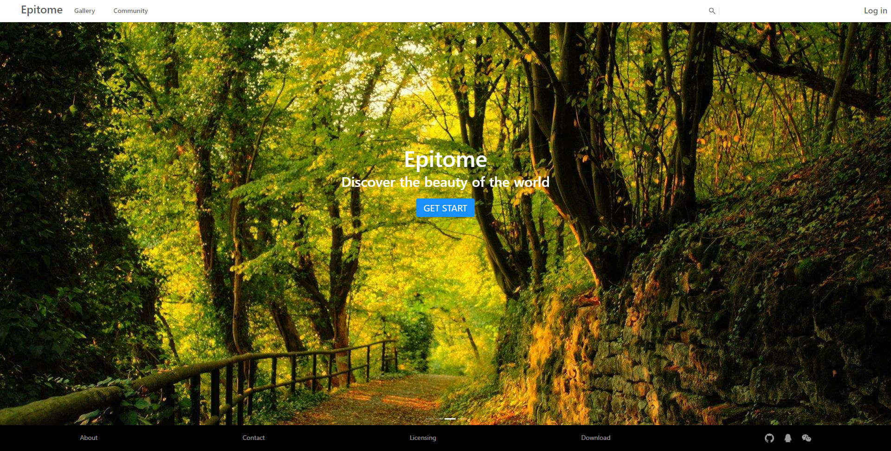
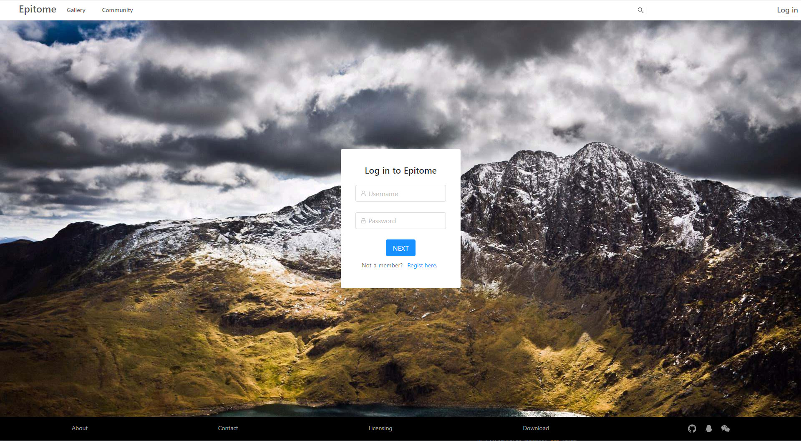
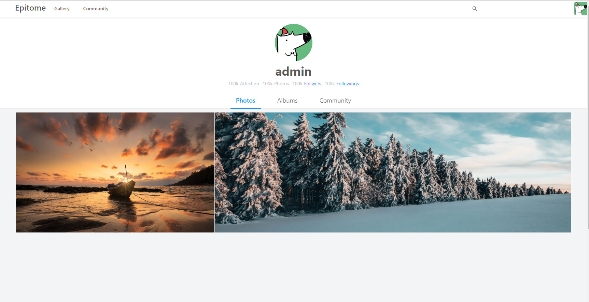
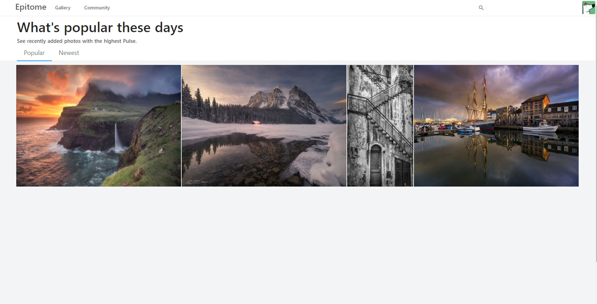
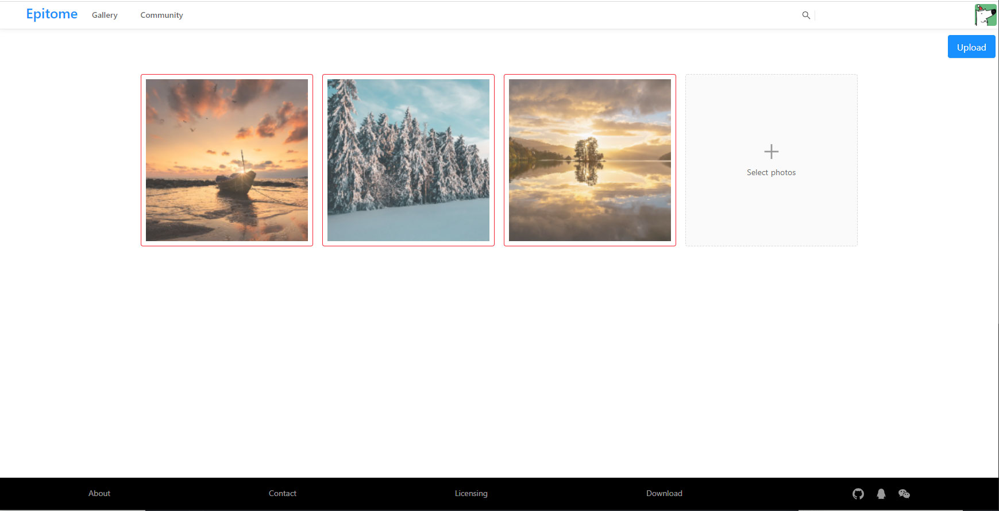

## Epitome

> 一款摄影分享网站，基于Nuxt.js + Ant Design，页面设计仿500px + flickr。

### Build Setup

```bash
# 安装依赖
$ npm install

# 启动
$ npm run dev

# 打包
$ npm run build
$ npm run start

# 生成静态文件
$ npm run generate
```
### 特性

- 服务端渲染，首屏渲染快，提升SEO。
- 支持响应式移动端适配。

- Vuex持久化登录，Cookies保存JWT，安全高效。

- 异步批量上传图片。

- 图片展示动态规划宽度。

- 基于Node后端打造。

  
### 页面展示

#### 首页

#### 登录

#### 个人中心

#### 发现

#### 上传

